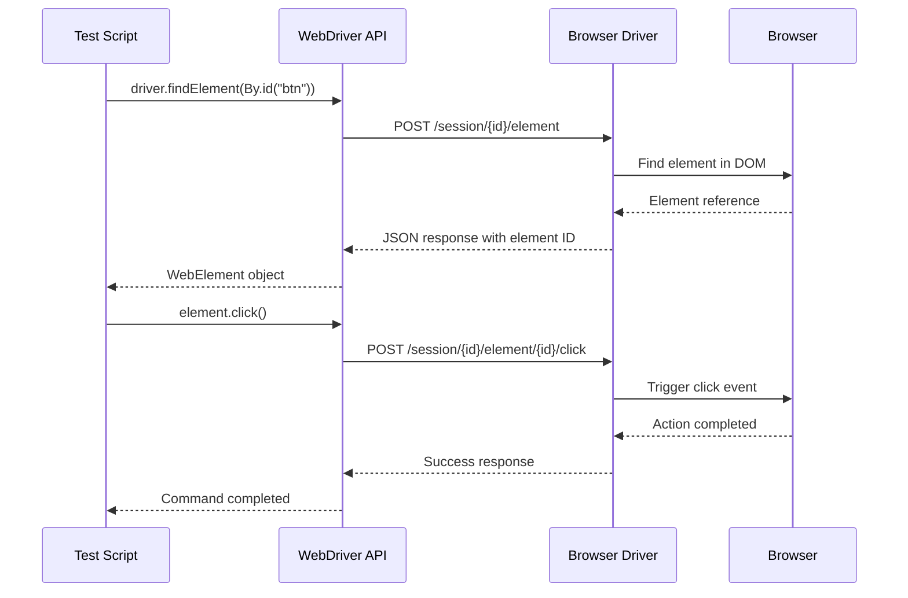
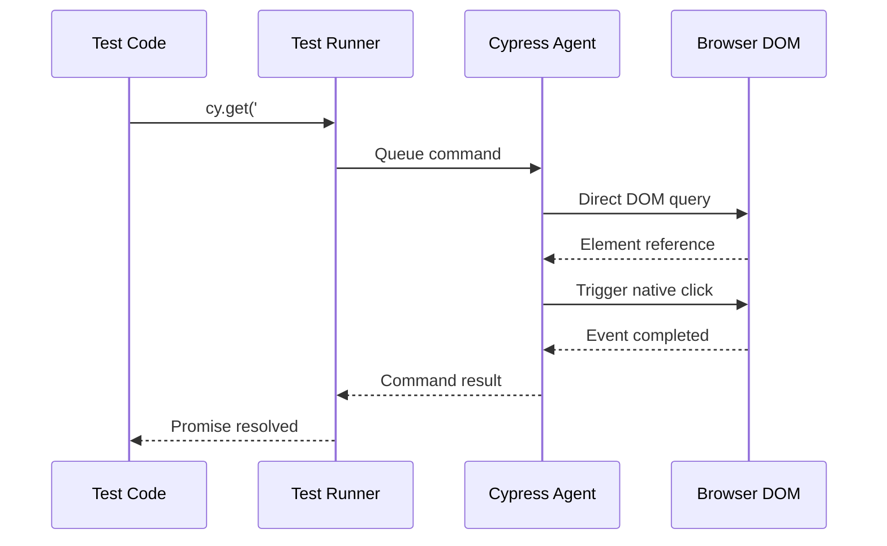
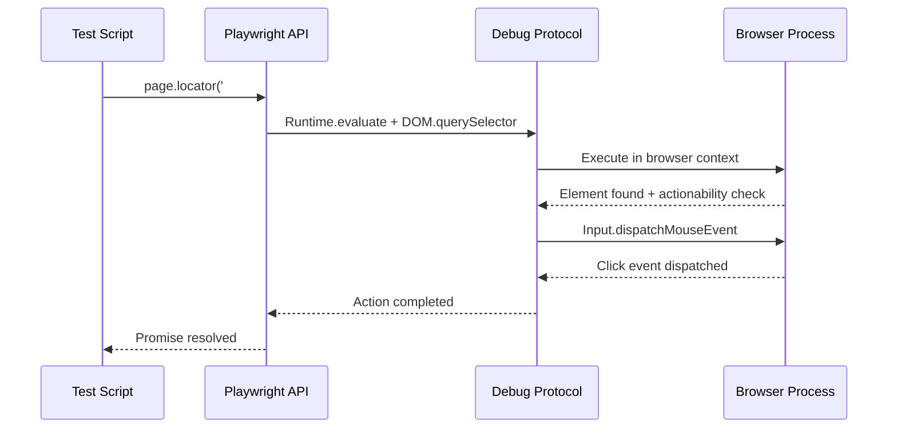

# Framework Comparison: Selenium vs Cypress vs Playwright

## 📊 Architecture Comparison Overview

| Aspect | Selenium WebDriver | Cypress | Playwright |
|--------|-------------------|---------|------------|
| **Architecture Type** | Client-Server (WebDriver Protocol) | Proxy-based (Same Origin) | Direct Browser Control (Debug Protocols) |
| **Communication** | HTTP/JSON over WebDriver Protocol | Direct JavaScript injection | Native Debug Protocols (CDP, FFP, WKP) |
| **Browser Support** | Chrome, Firefox, Safari, Edge, IE | Chrome, Firefox, Edge, Electron | Chromium, Firefox, WebKit |
| **Language Support** | Java, Python, C#, JavaScript, Ruby, etc. | JavaScript, TypeScript | JavaScript, Python, Java, .NET |
| **Execution Model** | External process communication | In-browser execution | Direct browser process control |

## 🏗️ Architectural Differences Deep Dive

### 1. Communication Architecture

#### Selenium WebDriver


**Characteristics:**
- Multiple network hops for each command
- Protocol translation overhead
- Language-agnostic communication
- Standardized W3C WebDriver specification

#### Cypress


**Characteristics:**
- Direct in-browser execution
- No protocol translation
- JavaScript-only environment
- Real-time bidirectional communication

#### Playwright


**Characteristics:**
- Native browser protocol communication
- Minimal overhead
- Multi-language support
- Direct browser process control

### 2. Browser Interaction Models

#### Selenium: External Control
- **Process Separation**: Test runs in separate process from browser
- **Protocol Dependency**: Relies on WebDriver protocol implementation
- **Driver Management**: Requires browser-specific drivers
- **Synchronization**: Manual wait strategies required

#### Cypress: Embedded Execution
- **Same Origin**: Test code runs inside the browser
- **Direct Access**: Native JavaScript access to DOM and APIs
- **Automatic Synchronization**: Built-in intelligent waiting
- **Network Control**: Proxy-based request/response interception

#### Playwright: Native Control
- **Process Management**: Direct browser process spawning and control
- **Protocol Native**: Uses browser's native debug protocols
- **Context Isolation**: Multiple isolated browser contexts
- **Auto-waiting**: Built-in actionability checks

## 🔄 Execution Flow Comparison

### Test Execution Patterns

#### Selenium WebDriver Flow
```javascript
// Selenium WebDriver (JavaScript example)
const { Builder, By, until } = require('selenium-webdriver');

async function seleniumTest() {
    const driver = await new Builder().forBrowser('chrome').build();
    
    try {
        // 1. Navigate (HTTP request to driver)
        await driver.get('https://example.com/login');
        
        // 2. Find element (HTTP request to driver)
        const usernameField = await driver.findElement(By.id('username'));
        
        // 3. Type text (HTTP request to driver)
        await usernameField.sendKeys('testuser');
        
        // 4. Explicit wait (polling via HTTP requests)
        await driver.wait(until.elementLocated(By.id('submit')), 10000);
        
        // 5. Click (HTTP request to driver)
        const submitBtn = await driver.findElement(By.id('submit'));
        await submitBtn.click();
        
    } finally {
        await driver.quit();
    }
}
```

#### Cypress Flow
```javascript
// Cypress
describe('Login Test', () => {
    it('should login successfully', () => {
        // 1. Navigate (direct browser navigation)
        cy.visit('https://example.com/login');
        
        // 2. Type (direct DOM manipulation, auto-wait)
        cy.get('#username').type('testuser');
        
        // 3. Click (direct event triggering, auto-wait)
        cy.get('#submit').click();
        
        // 4. Assert (automatic retry until condition met)
        cy.url().should('include', '/dashboard');
    });
});
```

#### Playwright Flow
```javascript
// Playwright
const { test, expect } = require('@playwright/test');

test('login test', async ({ page }) => {
    // 1. Navigate (CDP navigation command)
    await page.goto('https://example.com/login');
    
    // 2. Type (CDP input with auto-wait)
    await page.locator('#username').fill('testuser');
    
    // 3. Click (CDP click with actionability checks)
    await page.locator('#submit').click();
    
    // 4. Assert (auto-retry until condition met)
    await expect(page).toHaveURL(/.*dashboard/);
});
```

## 📈 Performance Comparison

### Speed and Efficiency

| Metric | Selenium | Cypress | Playwright |
|--------|----------|---------|------------|
| **Command Execution** | Slow (HTTP overhead) | Fast (Direct execution) | Fast (Native protocols) |
| **Element Location** | Multiple HTTP calls | Direct DOM access | Single protocol call |
| **Waiting Strategy** | Manual/Explicit waits | Automatic retry | Auto-wait with actionability |
| **Parallel Execution** | Grid setup required | Limited (same origin) | Built-in parallel support |
| **Browser Startup** | Slow (driver + browser) | Medium (proxy setup) | Fast (direct process spawn) |

### Resource Usage

#### Selenium
- **Memory**: High (separate processes for driver and browser)
- **CPU**: Medium (protocol translation overhead)
- **Network**: High (constant HTTP communication)

#### Cypress
- **Memory**: Medium (browser + test runner)
- **CPU**: Low (direct execution)
- **Network**: Low (local communication)

#### Playwright
- **Memory**: Medium (browser processes + contexts)
- **CPU**: Low (native protocol efficiency)
- **Network**: Low (direct protocol communication)

## 🎯 Use Case Recommendations

### Choose Selenium When:
- **Multi-language requirement**: Team uses Java, Python, C#, etc.
- **Legacy browser support**: Need IE or older browser versions
- **Existing infrastructure**: Already have Selenium Grid setup
- **Cross-platform testing**: Need extensive OS/browser combinations
- **Large enterprise**: Established Selenium expertise and tooling

### Choose Cypress When:
- **JavaScript/TypeScript team**: Frontend developers writing tests
- **Modern web apps**: Single-page applications with rich interactions
- **Developer experience priority**: Need excellent debugging and development tools
- **API + UI testing**: Want to combine API and UI tests seamlessly
- **Time-travel debugging**: Need to debug test failures interactively

### Choose Playwright When:
- **Multi-browser requirement**: Need Chrome, Firefox, and Safari support
- **Performance critical**: Need fastest possible test execution
- **Mobile testing**: Require mobile device emulation
- **Visual testing**: Need built-in screenshot comparison
- **Modern architecture**: Starting fresh with latest technology
- **Parallel execution**: Need efficient parallel test execution

## 🔧 Technical Capabilities Matrix

| Feature | Selenium | Cypress | Playwright |
|---------|----------|---------|------------|
| **Cross-browser** | ✅ Excellent | ⚠️ Limited | ✅ Excellent |
| **Mobile testing** | ✅ Via Appium | ❌ No | ✅ Device emulation |
| **Parallel execution** | ✅ Via Grid | ⚠️ Limited | ✅ Built-in |
| **Network interception** | ❌ No | ✅ Excellent | ✅ Excellent |
| **Auto-waiting** | ❌ Manual | ✅ Excellent | ✅ Excellent |
| **Debugging** | ⚠️ Basic | ✅ Excellent | ✅ Good |
| **CI/CD integration** | ✅ Mature | ✅ Good | ✅ Excellent |
| **Learning curve** | ⚠️ Steep | ✅ Easy | ✅ Moderate |
| **Community** | ✅ Largest | ✅ Active | ✅ Growing |
| **Enterprise support** | ✅ Extensive | ✅ Good | ✅ Growing |

## 🚀 Migration Considerations

### From Selenium to Cypress
**Pros:**
- Faster test execution
- Better developer experience
- Automatic waiting eliminates flaky tests
- Excellent debugging capabilities

**Cons:**
- JavaScript/TypeScript only
- Same-origin limitations
- Limited browser support
- Requires test rewrite

### From Selenium to Playwright
**Pros:**
- Faster execution with auto-waiting
- Better browser support than Cypress
- Multiple language bindings
- Built-in parallel execution

**Cons:**
- Newer ecosystem (fewer resources)
- Learning curve for new APIs
- Requires test rewrite

### From Cypress to Playwright
**Pros:**
- Better cross-browser support
- Mobile device emulation
- Multiple language support
- Better parallel execution

**Cons:**
- Less mature debugging experience
- Different API paradigms
- Requires test rewrite

## 📋 Decision Framework

### Questions to Ask:

1. **What languages does your team use?**
   - Multi-language → Selenium or Playwright
   - JavaScript/TypeScript only → Any framework

2. **What browsers do you need to support?**
   - Safari required → Selenium or Playwright
   - Chrome/Firefox only → Any framework

3. **How important is test execution speed?**
   - Critical → Playwright or Cypress
   - Moderate → Any framework

4. **Do you need mobile testing?**
   - Yes → Playwright or Selenium (with Appium)
   - No → Any framework

5. **What's your team's experience level?**
   - Beginners → Cypress
   - Experienced → Any framework

6. **Do you have existing test infrastructure?**
   - Selenium Grid → Consider staying with Selenium
   - Starting fresh → Playwright or Cypress

### Decision Matrix Score:
Rate each factor (1-5) based on importance to your project:

| Factor | Weight | Selenium | Cypress | Playwright |
|--------|--------|----------|---------|------------|
| Language flexibility | ___ | 5 | 2 | 4 |
| Browser support | ___ | 5 | 3 | 4 |
| Execution speed | ___ | 2 | 4 | 5 |
| Learning curve | ___ | 2 | 5 | 4 |
| Debugging experience | ___ | 2 | 5 | 4 |
| Community/Resources | ___ | 5 | 4 | 3 |
| **Total Score** | | ___ | ___ | ___ |

Choose the framework with the highest weighted score for your specific needs.