# Cypress Architecture

## 🏗️ High-Level Architecture

```mermaid
graph TB
    subgraph "Test Runner Environment"
        TR[Cypress Test Runner<br/>Node.js Process]
        TC[Test Code<br/>JavaScript/TypeScript]
    end
    
    subgraph "Browser Environment"
        subgraph "Cypress Proxy"
            CP[Cypress Proxy<br/>Intercepts Network]
            CA[Cypress Agent<br/>Injected Script]
        end
        
        subgraph "Browser Context"
            DOM[DOM<br/>Application Under Test]
            JS[JavaScript Runtime]
        end
    end
    
    subgraph "External Services"
        API[External APIs]
        CDN[CDN Resources]
    end
    
    TR <--> CA
    TC --> TR
    CA --> DOM
    CA --> JS
    CP --> API
    CP --> CDN
    DOM --> CP
    
    style CA fill:#00BFA5
    style CP fill:#00BFA5
    style TR fill:#17202A
```



## 🔧 Architecture Components

### 1. Cypress Test Runner (Node.js Process)
- **Purpose**: Orchestrates test execution and provides development interface
- **Key Features**:
  - Real-time test execution
  - Time-travel debugging
  - Automatic screenshots and videos
  - Interactive test runner GUI
- **Responsibilities**:
  - Parse and execute test files
  - Manage browser lifecycle
  - Handle file system operations
  - Generate reports and artifacts

### 2. Test Code Layer
- **Languages**: JavaScript, TypeScript
- **Structure**: Mocha-based syntax with Cypress commands
- **Key APIs**:
  - `cy.visit()` - Navigate to pages
  - `cy.get()` - Select elements
  - `cy.click()`, `cy.type()` - Interact with elements
  - `cy.intercept()` - Network stubbing/spying

### 3. Cypress Proxy
- **Purpose**: Intercepts and controls all network traffic
- **Capabilities**:
  - Network request/response modification
  - API mocking and stubbing
  - Traffic inspection and logging
  - CORS handling
- **Benefits**:
  - Complete network control
  - Deterministic testing
  - API testing capabilities

### 4. Cypress Agent (Injected Script)
- **Purpose**: Executes commands directly in browser context
- **Injection Method**: Automatically injected into every page
- **Capabilities**:
  - Direct DOM manipulation
  - JavaScript execution
  - Event triggering
  - Real-time synchronization
- **Advantages**:
  - No WebDriver protocol overhead
  - Native browser speed
  - Automatic waiting

### 5. Browser Context
- **Supported Browsers**: Chrome, Firefox, Edge, Electron
- **Execution Model**: Same-origin execution
- **Limitations**: Single tab, single domain per test
- **Benefits**: Native JavaScript access, real browser behavior

## 🔄 Component Interactions

### 1. Test Execution Flow
```
Test Code → Test Runner → Cypress Agent → Browser DOM → Application
```

### 2. Command Execution Sequence
1. **Command Queue**: Cypress commands are queued, not executed immediately
2. **Asynchronous Execution**: Commands execute asynchronously with automatic retries
3. **Direct DOM Access**: Agent directly manipulates DOM without protocol translation
4. **Automatic Waiting**: Built-in intelligent waiting for elements and conditions

### 3. Network Interception Flow
```
Browser Request → Cypress Proxy → External API → Cypress Proxy → Browser Response
```

### 4. Real-time Synchronization
- **Bidirectional Communication**: Test Runner ↔ Cypress Agent
- **State Synchronization**: Real-time test state updates
- **Debug Information**: Live DOM snapshots and command logs

## 📁 Standard Project Structure

### Basic Cypress Project
```
cypress-project/
├── cypress/
│   ├── e2e/                    # End-to-end test files
│   │   ├── auth/
│   │   │   ├── login.cy.js
│   │   │   └── registration.cy.js
│   │   ├── dashboard/
│   │   │   └── dashboard.cy.js
│   │   └── api/
│   │       └── api-tests.cy.js
│   ├── fixtures/               # Test data files
│   │   ├── users.json
│   │   ├── products.json
│   │   └── api-responses.json
│   ├── support/               # Support files and custom commands
│   │   ├── commands.js        # Custom Cypress commands
│   │   ├── e2e.js            # Global configuration and imports
│   │   └── page-objects/      # Page Object Model (optional)
│   │       ├── LoginPage.js
│   │       └── DashboardPage.js
│   └── downloads/             # Downloaded files during tests
├── cypress.config.js          # Main Cypress configuration
├── package.json              # Node.js dependencies
└── README.md
```

### Advanced Project Structure
```
cypress-advanced-project/
├── cypress/
│   ├── e2e/
│   │   ├── critical-path/     # Critical user journeys
│   │   ├── regression/        # Regression test suite
│   │   ├── smoke/            # Smoke tests
│   │   └── integration/      # Integration tests
│   ├── fixtures/
│   │   ├── environments/     # Environment-specific data
│   │   │   ├── dev.json
│   │   │   ├── staging.json
│   │   │   └── prod.json
│   │   └── test-data/        # Organized test data
│   │       ├── users/
│   │       └── products/
│   ├── support/
│   │   ├── commands/         # Organized custom commands
│   │   │   ├── auth-commands.js
│   │   │   ├── api-commands.js
│   │   │   └── ui-commands.js
│   │   ├── page-objects/     # Page Object Model
│   │   │   ├── base/
│   │   │   │   └── BasePage.js
│   │   │   ├── auth/
│   │   │   │   └── LoginPage.js
│   │   │   └── dashboard/
│   │   │       └── DashboardPage.js
│   │   ├── utils/           # Utility functions
│   │   │   ├── data-helpers.js
│   │   │   └── api-helpers.js
│   │   └── e2e.js
│   └── plugins/             # Custom plugins (if needed)
├── cypress.config.js
├── cypress.env.json         # Environment variables
├── package.json
├── .gitignore
└── README.md
```

## ⚙️ Key Configuration Files

### cypress.config.js
```javascript
const { defineConfig } = require('cypress')

module.exports = defineConfig({
  e2e: {
    baseUrl: 'https://example.com',
    viewportWidth: 1280,
    viewportHeight: 720,
    defaultCommandTimeout: 10000,
    requestTimeout: 10000,
    responseTimeout: 10000,
    video: true,
    screenshotOnRunFailure: true,
    
    // Test file patterns
    specPattern: 'cypress/e2e/**/*.cy.{js,jsx,ts,tsx}',
    
    // Environment-specific settings
    env: {
      apiUrl: 'https://api.example.com',
      username: 'testuser',
      password: 'testpass'
    },
    
    setupNodeEvents(on, config) {
      // Plugin configuration
      return config
    },
  },
  
  component: {
    devServer: {
      framework: 'react',
      bundler: 'webpack',
    },
  },
})
```

### package.json
```json
{
  "name": "cypress-automation",
  "version": "1.0.0",
  "scripts": {
    "cy:open": "cypress open",
    "cy:run": "cypress run",
    "cy:run:chrome": "cypress run --browser chrome",
    "cy:run:firefox": "cypress run --browser firefox",
    "cy:run:headed": "cypress run --headed",
    "cy:run:smoke": "cypress run --spec 'cypress/e2e/smoke/**/*'",
    "cy:run:regression": "cypress run --spec 'cypress/e2e/regression/**/*'"
  },
  "devDependencies": {
    "cypress": "^13.6.0",
    "@cypress/grep": "^4.0.1",
    "cypress-mochawesome-reporter": "^3.7.0"
  }
}
```

## 🎯 Unique Cypress Features

### 1. Time Travel Debugging
- **DOM Snapshots**: Every command creates a DOM snapshot
- **Interactive Timeline**: Click through command history
- **State Inspection**: Examine application state at any point

### 2. Automatic Waiting
- **Built-in Retries**: Commands automatically retry until conditions are met
- **No Explicit Waits**: Eliminates need for sleep() or explicit wait commands
- **Smart Assertions**: Automatically wait for assertions to pass

### 3. Network Control
```javascript
// Intercept and stub API calls
cy.intercept('GET', '/api/users', { fixture: 'users.json' }).as('getUsers')
cy.visit('/dashboard')
cy.wait('@getUsers')

// Modify responses on the fly
cy.intercept('POST', '/api/login', (req) => {
  req.reply({ statusCode: 200, body: { token: 'fake-token' } })
})
```

### 4. Real Browser Testing
- **Native Events**: Real click, type, and scroll events
- **CSS and JavaScript**: Full CSS and JavaScript execution
- **Browser DevTools**: Access to browser developer tools

## 🚀 Best Practices

### 1. Test Organization
- Group tests by feature or user journey
- Use descriptive test names and descriptions
- Implement proper test data management

### 2. Custom Commands
```javascript
// cypress/support/commands.js
Cypress.Commands.add('login', (username, password) => {
  cy.visit('/login')
  cy.get('[data-cy=username]').type(username)
  cy.get('[data-cy=password]').type(password)
  cy.get('[data-cy=login-button]').click()
})
```

### 3. Page Object Model (Optional)
```javascript
// cypress/support/page-objects/LoginPage.js
class LoginPage {
  visit() {
    cy.visit('/login')
  }
  
  fillUsername(username) {
    cy.get('[data-cy=username]').type(username)
    return this
  }
  
  fillPassword(password) {
    cy.get('[data-cy=password]').type(password)
    return this
  }
  
  submit() {
    cy.get('[data-cy=login-button]').click()
  }
}

export default LoginPage
```

### 4. Environment Management
- Use cypress.env.json for environment variables
- Implement environment-specific configurations
- Secure sensitive data handling