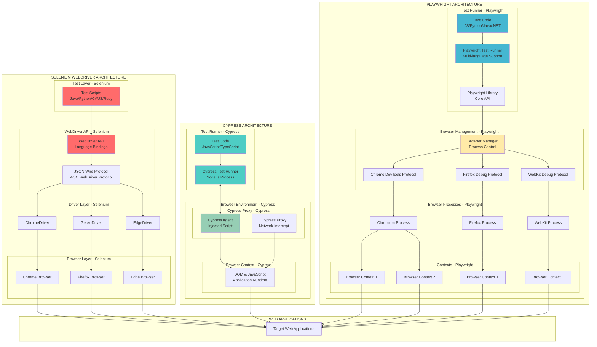
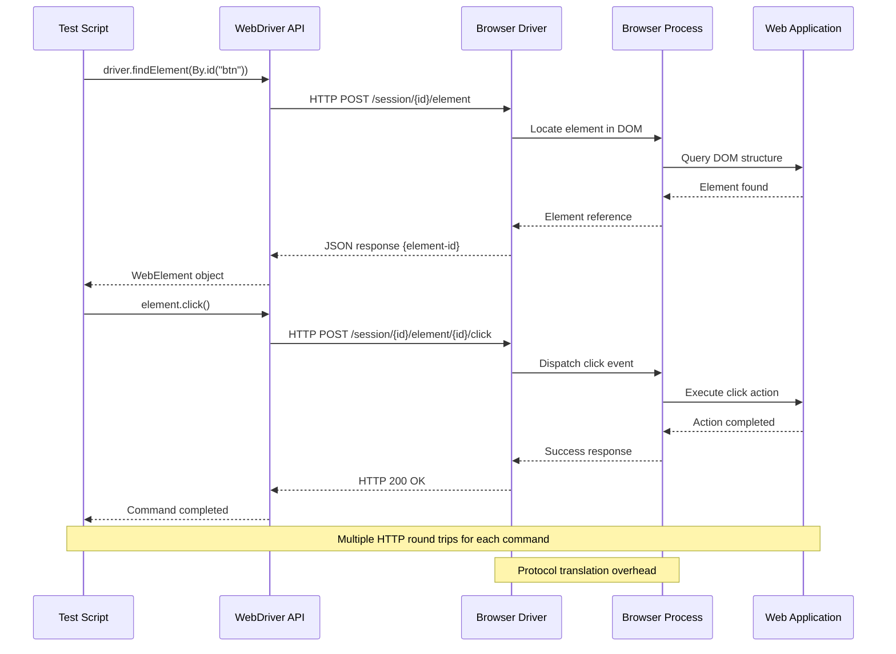
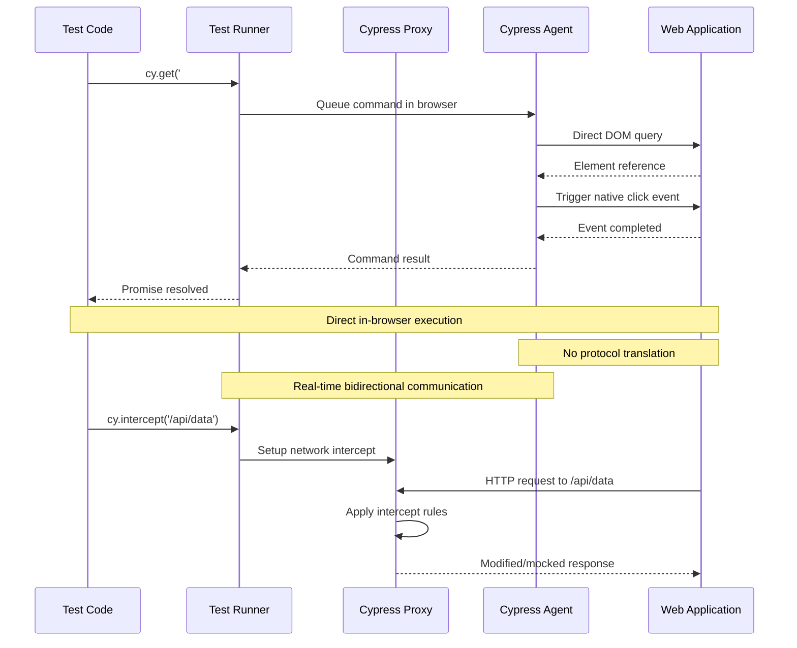
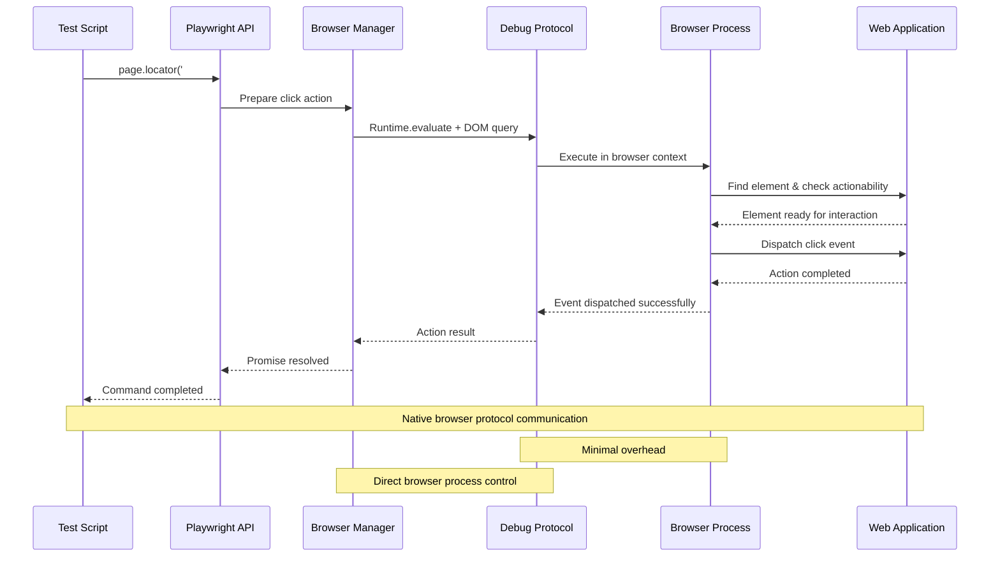
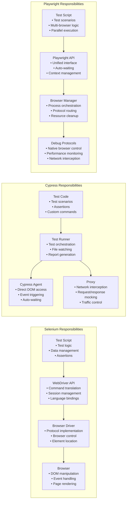
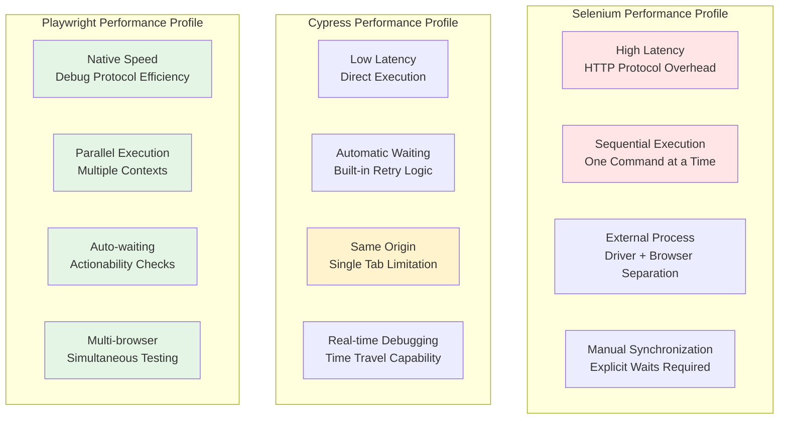

# Test Automation Architecture Diagrams

## 🏗️ Complete Architecture Comparison

## 🔄 Communication Flow Diagrams

### Selenium WebDriver Communication Flow

### Cypress Communication Flow

### Playwright Communication Flow

## 🏛️ Architectural Patterns Comparison

### Component Responsibility Matrix

## 🎯 Architecture Decision Factors

### Performance Characteristics

## 🔧 Integration Architecture Patterns

### CI/CD Integration Comparison

```mermaid
graph TB
    subgraph "Selenium CI/CD"
        SCI1[Source Code] --> SCI2[Build Pipeline]
        SCI2 --> SCI3[Selenium Grid Setup]
        SCI3 --> SCI4[Driver Management]
        SCI4 --> SCI5[Test Execution]
        SCI5 --> SCI6[Results Collection]
        SCI6 --> SCI7[Report Generation]
    end
    
    subgraph "Cypress CI/CD"
        CCI1[Source Code] --> CCI2[Build Pipeline]
        CCI2 --> CCI3[Cypress Installation]
        CCI3 --> CCI4[Browser Download]
        CCI4 --> CCI5[Test Execution]
        CCI5 --> CCI6[Video/Screenshot Capture]
        CCI6 --> CCI7[Dashboard Upload]
    end
    
    subgraph "Playwright CI/CD"
        PCI1[Source Code] --> PCI2[Build Pipeline]
        PCI2 --> PCI3[Playwright Install]
        PCI3 --> PCI4[Browser Download]
        PCI4 --> PCI5[Parallel Test Execution]
        PCI5 --> PCI6[Trace Collection]
        PCI6 --> PCI7[HTML Report Generation]
    end
    
    style SCI3 fill:#FFE5E5
    style SCI4 fill:#FFE5E5
    style CCI6 fill:#E5F5E5
    style CCI7 fill:#E5F5E5
    style PCI5 fill:#E5F5E5
    style PCI6 fill:#E5F5E5
```

This comprehensive architectural overview shows how each framework approaches the same fundamental challenge of browser automation through different architectural patterns and design philosophies.