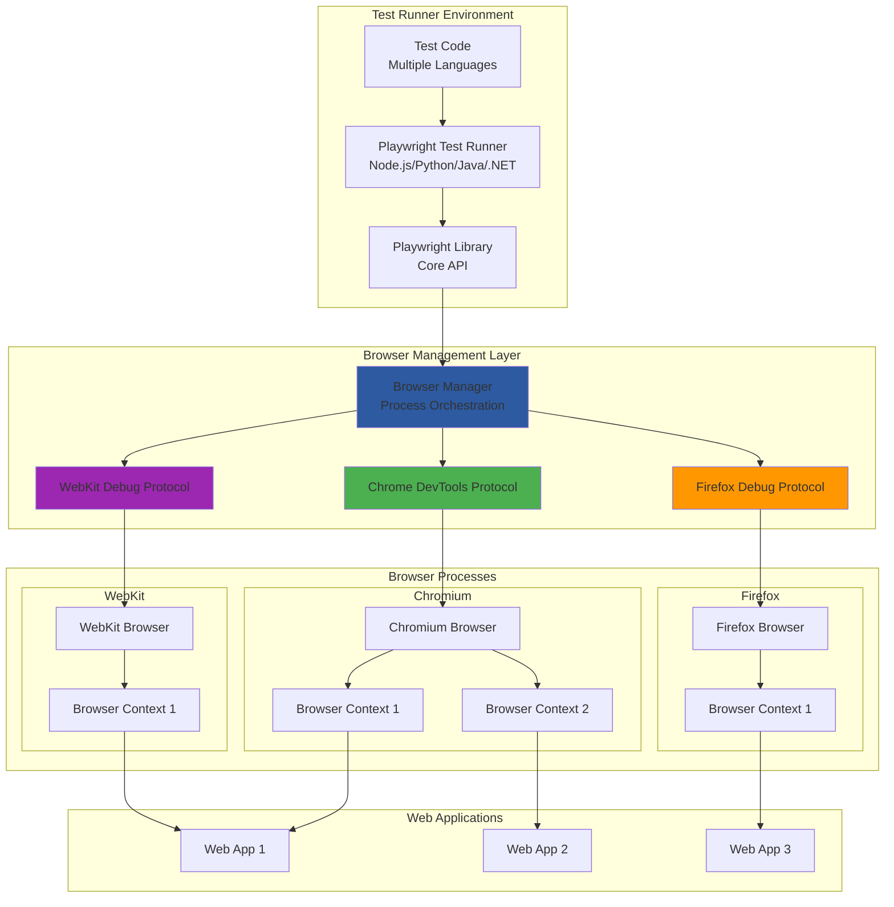

# Playwright Architecture

## 🏗️ High-Level Architecture



## 🔧 Architecture Components

### 1. Playwright Test Runner
- **Purpose**: Orchestrates test execution across multiple browsers
- **Languages**: JavaScript/TypeScript, Python, Java, .NET
- **Key Features**:
  - Parallel test execution
  - Built-in test runner with rich reporting
  - Automatic browser management
  - Cross-browser testing
- **Responsibilities**:
  - Test discovery and execution
  - Browser lifecycle management
  - Report generation and artifacts collection

### 2. Playwright Core Library
- **Purpose**: Provides unified API across all supported languages
- **Key APIs**:
  - `page.goto()` - Navigation
  - `page.locator()` - Element selection with auto-waiting
  - `page.click()`, `page.fill()` - Interactions
  - `page.route()` - Network interception
- **Features**:
  - Auto-waiting for elements
  - Network interception and mocking
  - Mobile device emulation
  - Geolocation and permissions

### 3. Browser Manager
- **Purpose**: Manages browser processes and communication protocols
- **Capabilities**:
  - Browser process spawning and termination
  - Protocol message routing
  - Context isolation management
  - Resource cleanup
- **Multi-Browser Support**: Handles different browser protocols seamlessly

### 4. Browser Debug Protocols
- **Chrome DevTools Protocol (CDP)**: For Chromium-based browsers
- **Firefox Debug Protocol**: For Firefox browsers  
- **WebKit Debug Protocol**: For Safari/WebKit browsers
- **Benefits**:
  - Direct browser control
  - Rich debugging capabilities
  - Network and performance monitoring

### 5. Browser Contexts
- **Purpose**: Isolated browser sessions within a single browser instance
- **Features**:
  - Independent cookies, storage, and cache
  - Separate authentication states
  - Parallel execution within same browser
  - Mobile device emulation per context

### 6. Browser Processes
- **Supported Browsers**:
  - **Chromium**: Google Chrome, Microsoft Edge
  - **Firefox**: Mozilla Firefox
  - **WebKit**: Safari (macOS), WebKit (Linux)
- **Execution Modes**:
  - Headed (visible) and headless modes
  - Mobile device emulation
  - Different viewport sizes and user agents

## 🔄 Component Interactions

### 1. Test Execution Flow
```
Test Code → Playwright API → Browser Manager → Debug Protocol → Browser → Web App
```

### 2. Multi-Browser Parallel Execution
1. **Test Discovery**: Playwright discovers test files and configurations
2. **Browser Allocation**: Spawns browser processes based on configuration
3. **Context Creation**: Creates isolated contexts for parallel test execution
4. **Test Distribution**: Distributes tests across available browser contexts
5. **Result Aggregation**: Collects results from all parallel executions

### 3. Auto-Waiting Mechanism
```
Locator Creation → Element Query → Actionability Checks → Action Execution
```

### 4. Network Interception Flow
```
Browser Request → Playwright Intercept → Custom Handler → Modified Request/Response
```

## 📁 Standard Project Structure

### JavaScript/TypeScript Project
```
playwright-project/
├── tests/                     # Test files
│   ├── auth/
│   │   ├── login.spec.ts
│   │   └── registration.spec.ts
│   ├── e2e/
│   │   ├── user-journey.spec.ts
│   │   └── checkout.spec.ts
│   ├── api/
│   │   └── api-tests.spec.ts
│   └── visual/
│       └── visual-regression.spec.ts
├── tests-examples/           # Example tests (generated)
├── page-objects/            # Page Object Model
│   ├── base-page.ts
│   ├── login-page.ts
│   └── dashboard-page.ts
├── fixtures/                # Test data
│   ├── users.json
│   └── test-data.json
├── utils/                   # Utility functions
│   ├── test-helpers.ts
│   ├── data-generators.ts
│   └── api-helpers.ts
├── config/                  # Environment configurations
│   ├── dev.config.ts
│   ├── staging.config.ts
│   └── prod.config.ts
├── test-results/           # Test execution results
├── playwright-report/      # HTML reports
├── screenshots/           # Visual comparison screenshots
├── videos/               # Test execution videos
├── playwright.config.ts  # Main Playwright configuration
├── package.json
└── README.md
```

### Python Project Structure
```
playwright-python-project/
├── tests/
│   ├── test_auth.py
│   ├── test_e2e.py
│   └── test_api.py
├── pages/                  # Page Object Model
│   ├── __init__.py
│   ├── base_page.py
│   ├── login_page.py
│   └── dashboard_page.py
├── fixtures/              # Test data
│   ├── users.json
│   └── test_data.json
├── utils/                 # Utilities
│   ├── __init__.py
│   ├── helpers.py
│   └── data_generators.py
├── config/               # Configuration
│   ├── __init__.py
│   └── settings.py
├── requirements.txt      # Python dependencies
├── pytest.ini          # pytest configuration
├── conftest.py         # pytest fixtures and configuration
└── README.md
```

## ⚙️ Key Configuration Files

### playwright.config.ts (JavaScript/TypeScript)
```typescript
import { defineConfig, devices } from '@playwright/test';

export default defineConfig({
  testDir: './tests',
  fullyParallel: true,
  forbidOnly: !!process.env.CI,
  retries: process.env.CI ? 2 : 0,
  workers: process.env.CI ? 1 : undefined,
  reporter: [
    ['html'],
    ['json', { outputFile: 'test-results/results.json' }],
    ['junit', { outputFile: 'test-results/results.xml' }]
  ],
  
  use: {
    baseURL: 'https://example.com',
    trace: 'on-first-retry',
    screenshot: 'only-on-failure',
    video: 'retain-on-failure',
  },

  projects: [
    {
      name: 'chromium',
      use: { ...devices['Desktop Chrome'] },
    },
    {
      name: 'firefox',
      use: { ...devices['Desktop Firefox'] },
    },
    {
      name: 'webkit',
      use: { ...devices['Desktop Safari'] },
    },
    {
      name: 'Mobile Chrome',
      use: { ...devices['Pixel 5'] },
    },
    {
      name: 'Mobile Safari',
      use: { ...devices['iPhone 12'] },
    },
  ],

  webServer: {
    command: 'npm run start',
    url: 'http://127.0.0.1:3000',
    reuseExistingServer: !process.env.CI,
  },
});
```

### conftest.py (Python)
```python
import pytest
from playwright.sync_api import Playwright, BrowserType
from typing import Generator

@pytest.fixture(scope="session")
def browser_type_launch_args(browser_type_launch_args):
    return {
        **browser_type_launch_args,
        "headless": True,
        "slow_mo": 100,
    }

@pytest.fixture(scope="session")
def browser_context_args(browser_context_args):
    return {
        **browser_context_args,
        "viewport": {"width": 1920, "height": 1080},
        "ignore_https_errors": True,
    }

@pytest.fixture
def page(page):
    page.set_default_timeout(30000)
    yield page
```

### package.json (JavaScript/TypeScript)
```json
{
  "name": "playwright-tests",
  "version": "1.0.0",
  "scripts": {
    "test": "playwright test",
    "test:headed": "playwright test --headed",
    "test:debug": "playwright test --debug",
    "test:ui": "playwright test --ui",
    "test:chromium": "playwright test --project=chromium",
    "test:firefox": "playwright test --project=firefox",
    "test:webkit": "playwright test --project=webkit",
    "test:mobile": "playwright test --project='Mobile Chrome'",
    "report": "playwright show-report",
    "codegen": "playwright codegen"
  },
  "devDependencies": {
    "@playwright/test": "^1.40.0",
    "@types/node": "^20.0.0"
  }
}
```

## 🎯 Unique Playwright Features

### 1. Auto-Waiting and Locators
```typescript
// Intelligent waiting built into locators
const button = page.locator('button:has-text("Submit")');
await button.click(); // Automatically waits for element to be actionable

// Chaining locators for precise targeting
const productCard = page.locator('.product-card').filter({ hasText: 'iPhone' });
await productCard.locator('button').click();
```

### 2. Browser Context Isolation
```typescript
// Multiple isolated contexts in same browser
const context1 = await browser.newContext({ storageState: 'user1-state.json' });
const context2 = await browser.newContext({ storageState: 'user2-state.json' });

const page1 = await context1.newPage();
const page2 = await context2.newPage();

// Both pages can run simultaneously with different user sessions
```

### 3. Network Interception and Mocking
```typescript
// Mock API responses
await page.route('**/api/users', route => {
  route.fulfill({
    status: 200,
    contentType: 'application/json',
    body: JSON.stringify([{ id: 1, name: 'Test User' }])
  });
});

// Modify requests
await page.route('**/api/**', route => {
  const headers = { ...route.request().headers(), 'Authorization': 'Bearer token' };
  route.continue({ headers });
});
```

### 4. Mobile Device Emulation
```typescript
// Emulate mobile devices
const iPhone = devices['iPhone 12'];
const context = await browser.newContext({
  ...iPhone,
  geolocation: { longitude: 12.492507, latitude: 41.889938 },
  permissions: ['geolocation'],
});
```

### 5. Visual Testing
```typescript
// Visual regression testing
await expect(page).toHaveScreenshot('homepage.png');

// Element-specific screenshots
await expect(page.locator('.header')).toHaveScreenshot('header.png');
```

### 6. Trace Viewer
- **Purpose**: Debug test failures with complete execution trace
- **Features**:
  - DOM snapshots at each step
  - Network activity timeline
  - Console logs and errors
  - Action timeline with screenshots

## 🚀 Best Practices

### 1. Page Object Model
```typescript
// pages/login-page.ts
export class LoginPage {
  constructor(private page: Page) {}

  async goto() {
    await this.page.goto('/login');
  }

  async login(username: string, password: string) {
    await this.page.locator('[data-testid=username]').fill(username);
    await this.page.locator('[data-testid=password]').fill(password);
    await this.page.locator('[data-testid=login-button]').click();
  }

  async getErrorMessage() {
    return await this.page.locator('[data-testid=error]').textContent();
  }
}
```

### 2. Test Organization and Fixtures
```typescript
// tests/auth.spec.ts
import { test, expect } from '@playwright/test';
import { LoginPage } from '../pages/login-page';

test.describe('Authentication', () => {
  let loginPage: LoginPage;

  test.beforeEach(async ({ page }) => {
    loginPage = new LoginPage(page);
    await loginPage.goto();
  });

  test('should login with valid credentials', async ({ page }) => {
    await loginPage.login('user@example.com', 'password');
    await expect(page).toHaveURL('/dashboard');
  });
});
```

### 3. Environment Configuration
```typescript
// config/environments.ts
export const environments = {
  dev: {
    baseURL: 'https://dev.example.com',
    apiURL: 'https://api-dev.example.com'
  },
  staging: {
    baseURL: 'https://staging.example.com',
    apiURL: 'https://api-staging.example.com'
  },
  prod: {
    baseURL: 'https://example.com',
    apiURL: 'https://api.example.com'
  }
};
```

### 4. Parallel Execution Strategy
- Configure workers based on system resources
- Use browser contexts for isolation
- Implement proper test data management
- Handle shared resources carefully