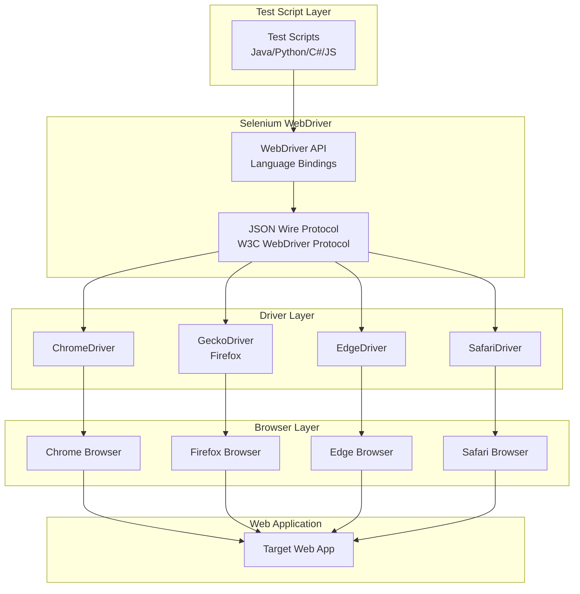

# Selenium WebDriver Architecture

## 🏗️ High-Level Architecture



## 🔧 Architecture Components

### 1. Test Script Layer
- **Purpose**: Contains your test automation code
- **Languages**: Java, Python, C#, JavaScript, Ruby, etc.
- **Responsibilities**: 
  - Define test scenarios and assertions
  - Manage test data and configuration
  - Handle test execution flow

### 2. WebDriver API (Language Bindings)
- **Purpose**: Provides programming language-specific interfaces
- **Key Classes**:
  - `WebDriver` interface
  - `WebElement` interface
  - `By` locator strategies
  - `Wait` conditions
- **Responsibilities**:
  - Translate high-level commands to protocol messages
  - Handle browser session management
  - Provide element interaction methods

### 3. JSON Wire Protocol / W3C WebDriver Protocol
- **Purpose**: Standardized communication protocol
- **Format**: RESTful HTTP API with JSON payloads
- **Key Endpoints**:
  - `/session` - Create/manage browser sessions
  - `/element` - Find and interact with elements
  - `/execute` - Run JavaScript in browser
- **Evolution**: Transitioned from JSON Wire to W3C standard

### 4. Browser Drivers
- **Purpose**: Browser-specific implementation of WebDriver protocol
- **Types**:
  - **ChromeDriver**: For Chrome/Chromium browsers
  - **GeckoDriver**: For Firefox browsers
  - **EdgeDriver**: For Microsoft Edge
  - **SafariDriver**: Built into Safari
- **Responsibilities**:
  - Translate WebDriver commands to browser-specific actions
  - Manage browser lifecycle
  - Handle browser-specific capabilities

### 5. Browser Layer
- **Purpose**: The actual browser that executes tests
- **Modes**:
  - **Headed**: Visible browser window
  - **Headless**: Background execution
- **Capabilities**: Configurable browser settings and features

## 🔄 Component Interactions

### 1. Test Execution Flow
```
Test Script → WebDriver API → Protocol → Driver → Browser → Web App
```

### 2. Element Interaction Sequence
1. **Find Element**: Test script calls `driver.findElement(By.id("button"))`
2. **Protocol Translation**: WebDriver API converts to HTTP POST `/element`
3. **Driver Processing**: Browser driver locates element in DOM
4. **Response**: Element reference returned through the chain
5. **Action Execution**: Subsequent actions (click, type) follow same pattern

### 3. Session Management
- **Session Creation**: Driver spawns browser instance
- **Session Maintenance**: Driver keeps connection alive
- **Session Cleanup**: Driver closes browser and cleans resources

## 📁 Standard Project Structure

### Java with Maven
```
selenium-java-project/
├── src/
│   ├── main/java/
│   │   ├── pages/              # Page Object Model classes
│   │   │   ├── BasePage.java
│   │   │   ├── LoginPage.java
│   │   │   └── HomePage.java
│   │   ├── utils/              # Utility classes
│   │   │   ├── DriverManager.java
│   │   │   ├── ConfigReader.java
│   │   │   └── TestDataProvider.java
│   │   └── config/             # Configuration classes
│   │       └── TestConfig.java
│   └── test/java/
│       ├── tests/              # Test classes
│       │   ├── BaseTest.java
│       │   ├── LoginTests.java
│       │   └── SmokeTests.java
│       └── runners/            # Test runners
│           └── TestRunner.java
├── src/test/resources/
│   ├── config.properties       # Configuration file
│   ├── testdata.json          # Test data
│   └── log4j2.xml            # Logging configuration
├── drivers/                   # Browser drivers
│   ├── chromedriver.exe
│   └── geckodriver.exe
├── reports/                   # Test reports
├── screenshots/              # Screenshot storage
├── pom.xml                   # Maven dependencies
└── testng.xml               # TestNG suite configuration
```

### Python with pytest
```
selenium-python-project/
├── pages/                    # Page Object Model
│   ├── __init__.py
│   ├── base_page.py
│   ├── login_page.py
│   └── home_page.py
├── tests/                    # Test modules
│   ├── __init__.py
│   ├── conftest.py          # pytest fixtures
│   ├── test_login.py
│   └── test_smoke.py
├── utils/                    # Utilities
│   ├── __init__.py
│   ├── driver_manager.py
│   ├── config_reader.py
│   └── test_data.py
├── config/                   # Configuration
│   ├── config.ini
│   └── test_data.json
├── drivers/                  # Browser drivers
├── reports/                  # Test reports
├── screenshots/             # Screenshots
├── requirements.txt         # Python dependencies
├── pytest.ini             # pytest configuration
└── README.md
```

## ⚙️ Key Configuration Files

### Maven POM.xml (Java)
```xml
<dependencies>
    <dependency>
        <groupId>org.seleniumhq.selenium</groupId>
        <artifactId>selenium-java</artifactId>
        <version>4.15.0</version>
    </dependency>
    <dependency>
        <groupId>org.testng</groupId>
        <artifactId>testng</artifactId>
        <version>7.8.0</version>
    </dependency>
    <dependency>
        <groupId>io.github.bonigarcia</groupId>
        <artifactId>webdrivermanager</artifactId>
        <version>5.6.2</version>
    </dependency>
</dependencies>
```

### Requirements.txt (Python)
```
selenium==4.15.0
pytest==7.4.3
pytest-html==4.1.1
webdriver-manager==4.0.1
allure-pytest==2.13.2
```

## 🎯 Best Practices

### 1. Driver Management
- Use WebDriverManager for automatic driver downloads
- Implement singleton pattern for driver instances
- Proper cleanup in teardown methods

### 2. Page Object Model
- Separate page logic from test logic
- Use meaningful element locators
- Implement wait strategies

### 3. Test Organization
- Group related tests in classes
- Use data providers for parameterized tests
- Implement proper test reporting

### 4. Configuration Management
- Externalize configuration in properties files
- Support multiple environments
- Use environment variables for sensitive data